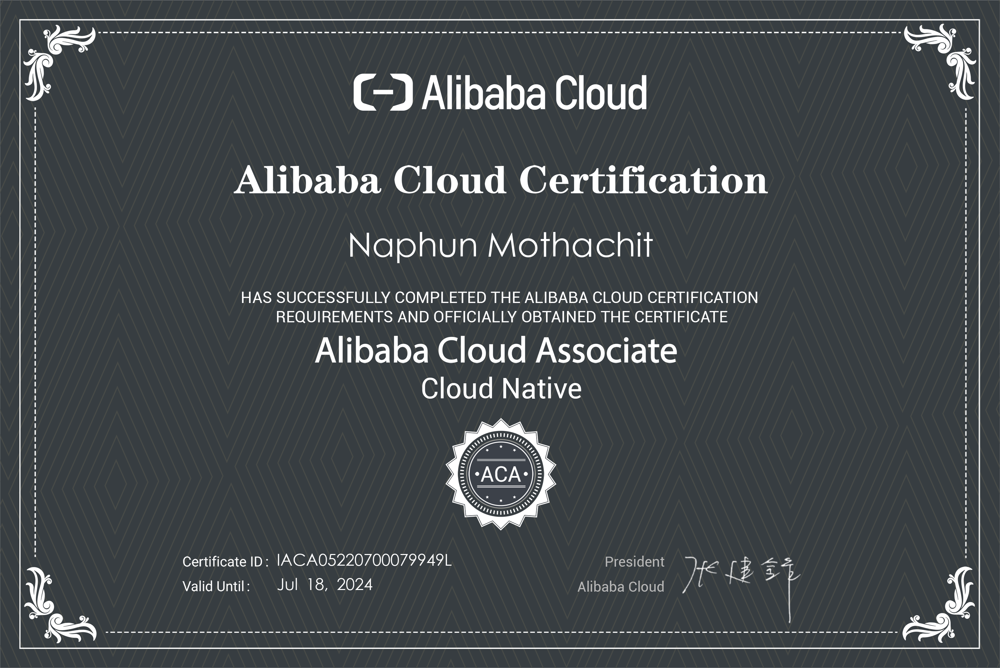
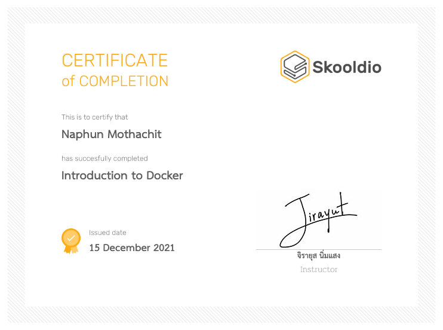
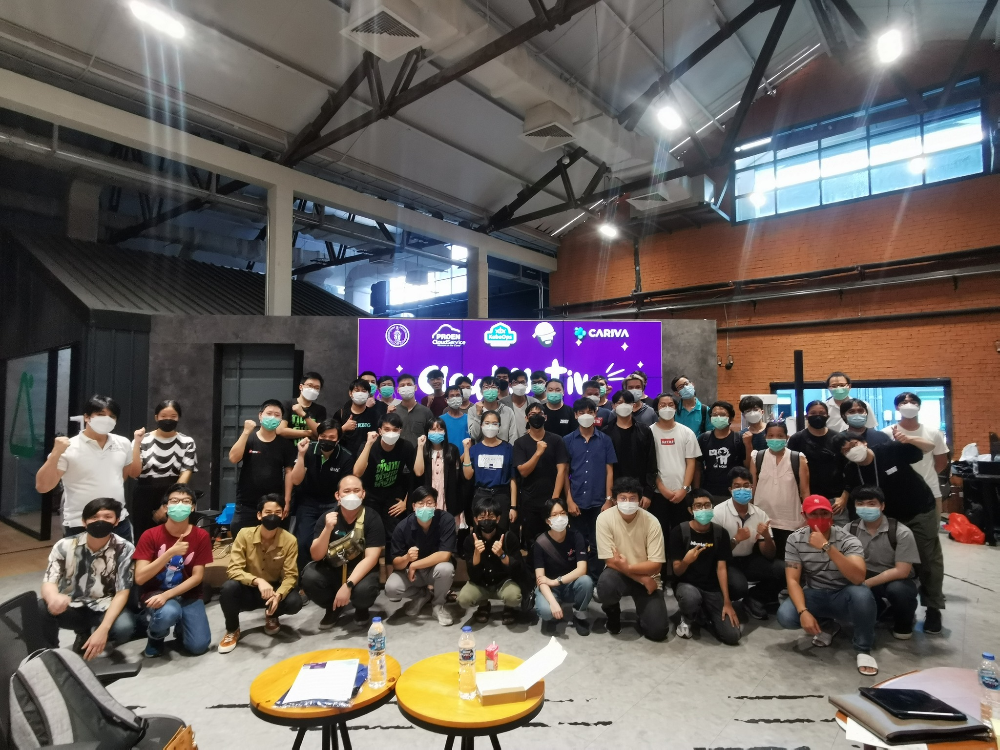
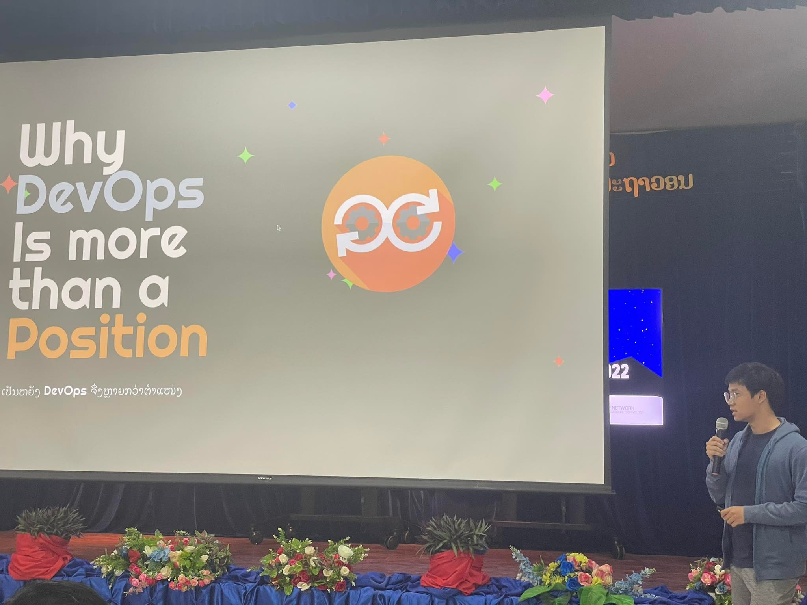

<h1> Hello! I'm Phylynlyn.</h1>

Welcome to my world!   I'm Pie, Software Engineer from  <b>Pathum Thani, Thailand</b>. 

<h3>Things I code with</h3>

  
  
  
  
  
  
  
  
  
  
  
  
  
  
  
  
  
  
  
  
  
  

<h3>My open source projects </h3>
<table>
  <thead align="center">
    <tr border: none;>
      <td><b>🎁 Projects</b></td>
      <td><b>⭐ Stars</b></td>
      <td><b>📚 Forks</b></td>
      <td><b>🛎 Issues</b></td>
      <td><b>📬 Pull requests</b></td>
    </tr>
  </thead>
  <tbody>
     <tr>
      <td><b>coming soon</b></a></td>
      <td><b>coming soon</b></a></td>
      <td><b>coming soon</b></a></td>
      <td><b>coming soon</b></a></td>
      <td><b>coming soon</b></a></td>
    </tr>
  </tbody>
</table>

<h3>My posts from Medium</h3>
<ul>
  <li><a href="https://medium.com/@naphun.m/container-for-new-starter-1-6a60feb68a4d"><b> Container for new Starter(1)
  </b></a> <i>How to create and know about concept of Container for new Starter!.</i></li>
  <li><a href="https://medium.com/@naphun.m/once-upon-a-time-in-kubeops-skills-ce3fed403a03"><b> Once Upon a Time in KubeOps Skills
  </b></a> <i>How do i enter to KubeOps Skills company? (Thai language).</i></li>
</ul>
<h3>My Certificate</h3>

    
    

<h3>Event that i involve</h3>

    
    

------------

 
